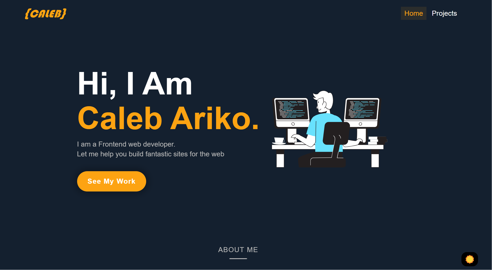

# 🌐 CALEB ARIKO – Frontend Developer Portfolio

Welcome to my personal frontend developer portfolio, first of its kind. This work showcases selected projects, skills and expertise and a pinch of me as I grow and evolve as a frontend web developer to embrace the dynamic world of tech.

> ⚡ Built with modern tools like **React**, **Vite**, **CSS3**, **AOS** and **GSAP** for animation.

---

##  About Me

I'm a frontend web developer passionate about crafting beautiful, responsive, and interactive web experiences. I specialize in building fast and accessible user interfaces using modern technologies like React, Vite, Tailwind, JavaScript, SCSS and more — with a focus on clean code and unforgetful design.

My goal is to deliver intuitive user experiences that feel as good as they look. This portfolio is a reflection of the work I so cherish doing — blending creativity, code, and personality.

I'm always learning, always building, and excited about where the future of greatness.

## 📸 Screenshot

## 📸 Live Demo

🔗 [Visit live site](https://calebariko.netlify.app)

---

## 🧩 Tech Stack

- ⚛️ React (with Vite)
- 🎨 CSS3 (for sections, pages, components)
- 🎞 GSAP (GreenSock Animation Platform)
- 🌐 Responsive & accessible layout
- 🧪 Vitest for unit/component testing

---

## 🚀 Features

- Smooth **page transitions** and **scroll-triggered animations**
- Dark/light mode toggle using color variables
- Component-based structure
- Fully **responsive** for desktop, tablet, and mobile
- **SEO-ready** meta tags and Open Graph support
- Custom **404 page**
- Font Awesome icons (self-hosted or via CDN)
- Smooth animations using AOS and GSAP

---

## 📁 Folder Structure

root/ 
    ── public/
    ── src/
        ── assets/
            ── css/
            ── fonts/
            ── images/
        ── components/
        ── data/
        ── hooks/
        ── pages/
        ── sections/
        ── App.jsx
        ── App.css
        ── Main.jsx
        ── Index.css
        ── other
    ── test/
    index.html 
    ── package.json 
    ── vite.config.js 
    ── README.md

## 📬 Contact Me

You can reach me on:

[🔗 GitHub](https://github.com/calebariko)

[💼 LinkedIn](https://linkedin.com/in/calebariko)

[📧 Email](calebouma202@gmail.com)

## 📝 License

This project is open source and available under the MIT License.

## 🙌 Acknowledgements
- GSAP
- Font Awesome
- React
- Vite
- Vitest